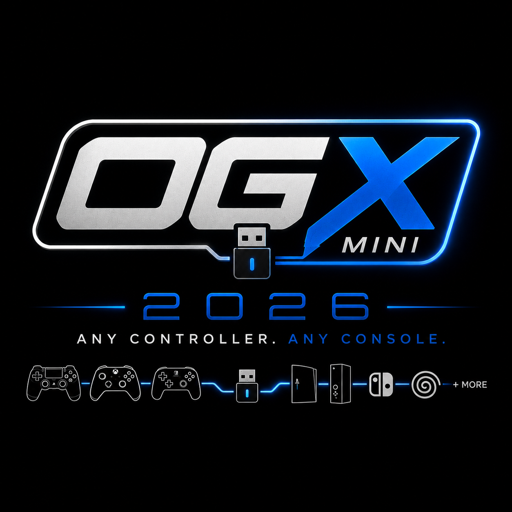
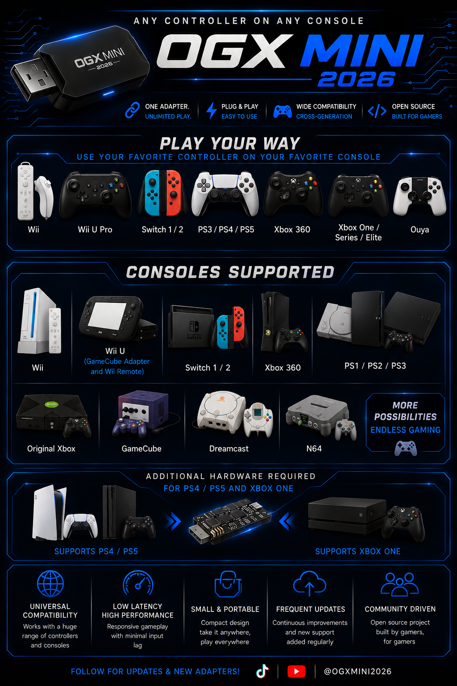

# OGX-Mini 2026

**Support development** — If this firmware helps you, consider **[donating on Ko-fi](https://ko-fi.com/megacadedev)**. Contributions go toward testing and adding support for **more boards and controllers** so the project can grow for everyone.

---



Firmware for the RP2040, capable of emulating gamepads for several game consoles. The firmware comes in many flavors, supported on the [Adafruit Feather USB Host board](https://www.adafruit.com/product/5723), Pi Pico, Pi Pico 2, Pi Pico W, Pi Pico 2 W, Waveshare RP2040-Zero, Waveshare RP2350-USB-A, Waveshare RP2350-Zero, Seeed Studio XIAO RP2040, RP2354, Pico/ESP32 hybrid, and a 4-Channel RP2040-Zero setup.

**Development & maintainer support:** Firmware development, testing, and issue triage focus on **official or OEM boards**—hardware from the original creators, named retail/partner boards in this repo’s build options, and equivalent OEM designs. Unofficial clones, random AliExpress spin-offs, or homebrew PCBs that only “look like” a supported board are **not** guaranteed to work and are **out of scope** for development support (you may still flash and experiment at your own risk).

[**Visit the web app here**](https://megacadedev.github.io/OGX-Mini-2026-WebApp/) to change your mappings and deadzone settings. To pair the OGX-Mini with the web app via USB, plug your controller in, then connect it to your PC, hold **Start + Left Bumper + Right Bumper** to enter web app mode. Click "Connect via USB" in the web app and select the OGX-Mini. You can also pair via Bluetooth, no extra steps are needed in that case. 

[**Join the discord here!**](https://discord.gg/HhZuSaSc4)

[**Follow on TikTok!**](https://www.tiktok.com/@ogxmini2026)

[**Subscribe on YouTube!**](https://www.youtube.com/@ogxmini2026)

## Supported platforms
- Original Xbox
- Playstation 3
- Nintendo Switch 1 & 2 (docked) — **Switch Pro Controller** emulation over USB
- XInput (Xbox 360, UsbdSecPatch no longer required)
- Playstation Classic
- DInput
- **SteamOS / Bazzite** — Linux desktop / Steam Deck (desktop mode): **DualSense** USB gamepad + **touchpad → HID mouse** (see [SteamOS / Bazzite output mode](#steamos--bazzite-output-mode))
- **PS3 / PS4 motion** — Sixaxis / accelerometer passthrough from DS4, DualSense, Switch Pro, and Wii Remote (see [Motion controls](#ps3--ps4-motion-controls))
- Wii U (GameCube Adapter)
- **Wii (Wiimote)** — Pico W / Pico 2 W only; build with `-DOGXM_FIXED_DRIVER=WII`. See [Wii Mode Guide](Firmware/RP2040/docs/Wii_Mode_Guide.md).
- **PlayStation 1 & 2** — GPIO output to console controller port (DualShock-style).
- **Dreamcast** — GPIO output over Maple Bus to console controller port.
- **GameCube / Wii (GameCube ports)** — GPIO output over single-wire JoyBus. **Build-only (no combo):** use `-DOGXM_FIXED_DRIVER=GAMECUBE`; see below.
- **Nintendo 64** — GPIO output over single-wire to controller port. **Build-only (no combo):** use `-DOGXM_FIXED_DRIVER=N64`; see below.



**RP2040 output modes:** **USB device:** XInput (Xbox 360 + XSM3), DInput, PS3, **PS4 (DualShock 4 USB)**, **STEAM (SteamOS / Bazzite — DualSense + touchpad mouse)**, **Switch Pro** (Nintendo Switch Pro Controller emulation), Wii U, **Wii (Wiimote, build-option only)**, Xbox OG (Gamepad / Steel Battalion / XRemote), PS Classic, Web App. **GPIO (no USB device):** PS1/PS2, Dreamcast, GameCube, N64 — use any wired USB or (on Pico W / Pico 2 W) Bluetooth controller as input. **Wii, GameCube, and N64 are not in the combo list** — use a dedicated build for those modes (see below).

## Changing platforms
By default the OGX-Mini will emulate an OG Xbox controller, you must hold a button combo for 3 seconds to change which platform you want to play on. Your chosen mode will persist after powering off the device. 

Start = Plus (Switch) = Options (Dualsense/DS4)

- XInput (Xbox 360)
    - Start + Dpad Up 
- Original Xbox
    - Start + Dpad Right
- Original Xbox Steel Battalion
    - Start + Dpad Right + Right Bumper
- Original Xbox DVD Remote
    - Start + Dpad Right + Left Bumper
- Switch (Pro Controller emulation)
    - Start + Dpad Down
- PlayStation 3
    - Start + Dpad Left
- PlayStation 4 (DualShock 4 USB)
    - Start + Left Bumper + D-pad **Left**
- SteamOS / Bazzite (DualSense USB + touchpad mouse)
    - Start + Left Bumper + D-pad **Up**
- PlayStation Classic
    - Start + A (Cross for PlayStation and B for Switch gamepads)
- PlayStation 1 / PlayStation 2 (GPIO output)
    - Start + B
- Dreamcast (GPIO output)
    - Start + Y
- Wii U (GameCube Adapter)
      - Start + Left Bumper + D-Pad Down
- Web Application Mode
    - Start + Left Bumper + Right Bumper

**Wii, GameCube, and N64 are not selectable by combo.** Use a dedicated build for those modes:

- **Wii (Wiimote):** `-DOGXM_FIXED_DRIVER=WII`. See [Wii Mode Guide](Firmware/RP2040/docs/Wii_Mode_Guide.md).
- **GameCube (GPIO):** `-DOGXM_FIXED_DRIVER=GAMECUBE`. Example (Pico 2 W Debug):  
  `cmake -DOGXM_BOARD=PI_PICO2W -DCMAKE_BUILD_TYPE=Debug -DOGXM_FIXED_DRIVER=GAMECUBE ..` then `ninja`. Flash `OGX-Mini-*-GAMECUBE.uf2`. Use `PI_PICOW` for Pico W.
- **N64 (GPIO):** `-DOGXM_FIXED_DRIVER=N64`. Example (Pico 2 W Debug):  
  `cmake -DOGXM_BOARD=PI_PICO2W -DCMAKE_BUILD_TYPE=Debug -DOGXM_FIXED_DRIVER=N64 ..` then `ninja`. Flash `OGX-Mini-*-N64.uf2`.

Input for GPIO modes is Bluetooth or USB; no combo switching in these builds.

After a new mode is stored, the RP2040 will reset itself so you don't need to unplug it.

## PS3 / PS4 motion controls

**PS3** and **PS4 (DualShock 4 USB)** output modes can forward **tilt / motion** from compatible input controllers into the emulated report (Sixaxis on PS3, accelerometer on PS4). **Switch** output mode does **not** pass through motion for now.

| | |
|--|--|
| **Select PS3 mode** | **Start + D-pad Left** (~3 s) |
| **Select PS4 mode** | **Start + Left Bumper + D-pad Left** (~3 s) |
| **Supported input (BT — Pico W / Pico 2 W)** | DualShock 4, DualSense, Switch Pro, **Wii Remote** (accelerometer) |
| **Supported input (wired USB host)** | DualShock 4, DualSense, Switch 1 Pro, Switch 2 Pro |
| **Wii Remote** | Point the **IR end at the TV**; motion is enabled automatically when motion output is active |
| **Play on a real PS3 or PS4** | OGX-Mini does **not** plug straight into the console for this — use a **USB adapter** between OGX-Mini and the console. **Tested with [Brook Wingman XE 2 Converter](https://www.brookaccessories.com/products/wingman-xe2).** Works on **PS3** (PS3 mode) and **PS4** (PS4 mode on OGX-Mini → Brook → PS4). |
| **PC testing (PS3/PS4)** | No Brook required — use PS3/PS4 mode on a PC/emulator to verify tilt |

**Typical chain for a PS3 motion game (e.g. *Flower*):**

```text
Wii Remote or DualSense (Bluetooth) → OGX-Mini (Pico W) → USB → Brook Wingman XE 2 → PS3
```

Details: [IMPROVEMENTS.md — motion passthrough](Firmware/RP2040/docs/IMPROVEMENTS.md#ps3--ps4-output--motion-passthrough).

## SteamOS / Bazzite output mode

Use this mode on **SteamOS**, **Bazzite**, or other **Linux desktops** (including **Steam Deck** in desktop mode) when you want the host to see a **PS5 DualSense** gamepad **and** use the **touchpad as a USB mouse** (cursor movement + tap to click). Games and Steam Input see a normal DualSense; the desktop gets a separate **HID mouse** for navigating outside games.

### Select mode

| Method | Combo / option |
|--------|----------------|
| **Button combo** | Hold **Start + Left Bumper + D-pad Up** for ~3 seconds (saved to flash; device resets) |
| **Web app** | Output mode **SteamOS / Bazzite** |
| **Fixed build** | `-DOGXM_FIXED_DRIVER=STEAM` (also in `./scripts/build.sh` / `build.ps1` fixed-mode menu) |

### DualSense USB emulation

The adapter presents **two USB interfaces** to the PC:

| Interface | Identity | Purpose |
|-----------|----------|---------|
| **Gamepad** | Sony **DualSense** `054c:0ce6`, 64-byte HID input report | Buttons, sticks, triggers, PS button — for Steam / Proton / desktop gamepad APIs |
| **Mouse** | Standard **relative HID mouse** (separate interface) | Cursor from **DualSense touchpad** only |

**Input → USB behavior:**

| Input controller | Gamepad report | Touchpad / mouse |
|------------------|----------------|------------------|
| **DualSense (PS5)** — Bluetooth or wired USB | **Passthrough** of the real DualSense report (sticks/triggers from host when wired) | Touchpad finger position → **relative mouse** movement; touchpad click (`TP`) → **left click** |
| **Other pads** (Xbox, DS4, Switch Pro, etc.) | **Synthesized** DualSense report — face buttons, shoulders, triggers, sticks, D-pad, **Share/Options**, **PS**, touchpad-click bit mapped from PadIn | No hardware touchpad — **no mouse** (gamepad only) |

Face-button mapping to DualSense: **A→Cross**, **B→Circle**, **X→Square**, **Y→Triangle**; **LB/RB→L1/R1**; **Back/Start→Share/Options**; **SYS→PS**. Full table: [Controller_Mappings.md — STEAM mode](Firmware/RP2040/docs/Controller_Mappings.md#steamos--bazzite-steam-mode).

After switching to STEAM mode, **unplug and replug** the adapter’s USB cable to the PC so Linux re-enumerates both interfaces. Verify with `lsusb -d 054c:0ce6` (two interfaces) and `evtest` on the mouse device.

### Touchpad → mouse (DualSense input)

When the **input** pad is a **DualSense** (Bluetooth on Pico W / Pico 2 W, or wired into the adapter’s USB host port):

- **Drag** on the touchpad → **relative mouse** movement on the PC (second USB interface).
- **Tap / click** the touchpad → **left mouse button**.
- The touchpad data is also embedded in the DualSense gamepad report (offset compatible with Linux `hid-playstation`).

Controllers **without** a DualSense touchpad still work as a DualSense gamepad; they do **not** drive the mouse interface.

### Other notes

- **On-screen keyboard:** Steam handles this — **Steam + X** on the controller (**PS + Square** on DualSense), same as Steam Deck desktop.
- **Input sources:** Most supported **USB** and **Bluetooth** controllers work as gamepad input; **touchpad → mouse** requires a **DualSense** (or other pad that reports touchpad data).

Fixed-build example (Pico 2 W):  
`cmake -DOGXM_BOARD=PI_PICO2W -DCMAKE_BUILD_TYPE=Release -DOGXM_FIXED_DRIVER=STEAM ..` then `ninja`.

Technical detail: [IMPROVEMENTS.md — STEAM mode](Firmware/RP2040/docs/IMPROVEMENTS.md#steam-mode--steamos--bazzite-linux-desktop).

## Disconnecting Controllers
For most controllers pressing and holding Start+Select (+/-, etc) for the controller will disconnect it and restart pairing mode.
For the OUYA controller there is no Start+Select, the disconnection combo has been set to L3+R3.

## Supported devices
### Wired controllers (USB input)
See [**Wired Controllers**](Firmware/RP2040/docs/Wired_Controllers.md) for a full list by driver type. The following work when the adapter is outputting to any supported platform (Xbox, Switch, XInput, PS3, DInput, **SteamOS / Bazzite**, **PS1/PS2**, **Dreamcast**, **GameCube**, **N64**, etc.):
- Original Xbox Duke and S
- Xbox 360, One, Series, and Elite
- **Razer Atrox Arcade Stick** (Xbox One `1532:0a00`, Xbox 360 `24c6:5000`; wired USB host)
- Dualshock 3 (PS3)
- Dualshock 4 (PS4)
- Dualsense (PS5)
- Nintendo Switch Pro
- Nintendo Switch wired (including **Switch 2** family — **Pro 2** `0x2069`, **Joy-Con 2** `0x2066`/`0x2067`; **wired USB** or **Bluetooth LE** on Pico W / Pico 2 W; see [Wired Controllers](Firmware/RP2040/docs/Wired_Controllers.md) and [IMPROVEMENTS — Switch 2 BLE](Firmware/RP2040/docs/IMPROVEMENTS.md#nintendo-switch-2--bluetooth-pico-w--pico-2-w))
- Nintendo 64 Generic USB
- Playstation Classic
- Generic DInput
- Generic HID (mappings may need to be editted in the web app)

Note: There are some third party controllers that can change their VID/PID, these might not work correctly.

### Wireless adapters
- Xbox 360 PC adapter (Microsoft)
- 8Bitdo v1 and v2 Bluetooth adapters (set to XInput mode)
- Most wireless adapters that present themselves as Switch/XInput/PlayStation controllers should work

### Wireless Bluetooth controllers (Pico W & ESP32)
**Note:** Bluetooth functionality is in early testing; some controllers may have quirks. BT pads work as input in **any** USB output mode (OG Xbox, XInput, PS3, Switch, etc.) on Pico W / Pico 2 W, and also when outputting over **GPIO** to **PS1/PS2**, **Dreamcast**, **GameCube**, or **N64** (same as wired USB in those modes).

**DualShock 3 (PS3) — USB pairing to the adapter’s Bluetooth (Pico W / Pico 2 W / RP2354):** The DS3 does not pair like a normal Bluetooth device. If you plug a **DualShock 3 into the adapter’s USB host port** while the firmware is running, it will **automatically program the controller with this adapter’s Bluetooth address** (HID feature **0xF5**, same mechanism as the [Bluepad32 sixaxispairer](https://bluepad32.readthedocs.io/en/latest/pair_ds3/) tool — restored in **v1.0.0.12a** as a sync SET after wired enable). Then **unplug the USB cable** and press the **PS** button to connect wirelessly. If the radio was not ready at the moment the pad enumerated, pairing is retried on the next input reports until the address is available.

**Pico W / Pico 2 W — important for DualShock 4 (DS4):** DS4 uses **Classic Bluetooth (BR/EDR)**. The same CYW43 radio also runs **BLE advertising** for the **phone / web app**. Running both at once often **drops the DS4 link** seconds after connect (blue LED then off). Firmware therefore **pauses BLE advertising** while a **Classic BT** gamepad is connected (DS4, DS3 over BT, Xbox 360 wireless adapter style links). **DualSense** and **Xbox Series (BLE)** mostly use **LE** and are unaffected by that pause.

| Situation | What to do |
|-----------|------------|
| Use **DS4 / Classic BT** pad | Connect and play; web app BLE discovery is off until that pad disconnects. |
| Use **Bluetooth** in the **web app** | Disconnect **Classic BT** controllers first, **or** plug the adapter in via **USB** and use **Connect via USB** in the app. |

Full technical detail: **[Firmware/RP2040/docs/IMPROVEMENTS.md](Firmware/RP2040/docs/IMPROVEMENTS.md)** → *Pico W / Pico 2 W — DualShock 4 and Classic Bluetooth stability*.

**Nintendo Switch 2 (Pico W / Pico 2 W):** **Switch 2 Pro** (PID **0x2069**) and **Joy-Con 2** Left (**0x2067**) / Right (**0x2066**) use a **custom BLE GATT protocol** (not standard gamepad HID). Put the controller in **pairing / SYNC** mode; the adapter discovers and connects automatically — **do not** pair it in your PC or phone Bluetooth settings first. **Joy-Con 2:** pair **Left** first, then **Right** while left stays connected — both merge into **player 1** like on a Switch. **Home** maps to **PS / Guide (SYS)** on PS3, XInput, OG Xbox, etc. Protocol credits: [Nadeflore/switch2-controllers](https://github.com/Nadeflore/switch2-controllers), [TommyWabg/switch2-controllers-windows10-gyro](https://github.com/TommyWabg/switch2-controllers-windows10-gyro), and [BlueRetro #1249](https://github.com/darthcloud/BlueRetro/issues/1249). Details: [IMPROVEMENTS — Switch 2 Bluetooth](Firmware/RP2040/docs/IMPROVEMENTS.md#nintendo-switch-2--bluetooth-pico-w--pico-2-w).

**Steam Controller 2026 / Triton (Pico W / Pico 2 W / RP2354 BT):** Hold **RB + B + Steam** for BLE pairing (`28de:1303`, HID-over-GATT). **Remove/disconnect it from PC or phone Bluetooth first** — only one host can own the link. Uses **LE Secure Connections**. **View → Start**, **Menu → Back/Select**, **Steam → Guide / SYS**. Details: [IMPROVEMENTS — Steam Controller 2026](Firmware/RP2040/docs/IMPROVEMENTS.md#steam-controller-2026-triton--bluetooth).

- Xbox Series, One, and Elite 2
- Dualshock 3
- Dualshock 4
- Dualsense
- Switch Pro
- **Switch 2 Pro** and **Joy-Con 2 (L/R)** (BLE on Pico W / Pico 2 W / RP2354; wired USB also supported)
- Steam (original SC)
- **Steam Controller 2026 (Triton)** — BLE on Pico W / Pico 2 W / RP2354
- Stadia
- Wii U Pro
- Wii Remote
   - Supported Extensions:
      - Gamepad
      - Nunchuck
      - GameCube Controller
- 8BitDo Ultimate Wireless (Switch layout)

Please visit [**this page**](https://bluepad32.readthedocs.io/en/latest/supported_gamepads/) for a more comprehensive list of supported controllers and Bluetooth pairing instructions.

# Features new to this fork

Version history and release notes are in **[CHANGELOG.md](CHANGELOG.md)**. For detailed firmware improvements — **PS3**, **XInput / XSM3**, **OG Xbox**, **PS2/OPL**, **latency**, **SteamOS / Bazzite (STEAM mode)**, **PS3 / PS4 motion passthrough**, **Pico W Bluetooth (DS4 Classic BT, BLE coexistence, Xbox Series BLE, Switch 2 Pro + Joy-Con 2 BLE, Steam Controller 2026 / Triton, DualShock 3 USB→BT auto-pair)**, **Pico W / Pico 2 W PIO USB wired unplug detection**, etc. — see **[Firmware/RP2040/docs/IMPROVEMENTS.md](Firmware/RP2040/docs/IMPROVEMENTS.md)**.

Highlights:

- **Steam Controller 2026 (Triton) over Bluetooth** — Pair with **RB + B + Steam** on Pico W / Pico 2 W / RP2354 (**`28de:1303`**). Requires LE Secure Connections; disconnect from any PC/phone first. **View → Start**, **Menu → Back**, **Steam → Guide**. Details: [IMPROVEMENTS — Steam Controller 2026](Firmware/RP2040/docs/IMPROVEMENTS.md#steam-controller-2026-triton--bluetooth).

- **DualShock 3 — USB → Bluetooth auto-pair (restored in v1.0.0.12a)** — Plug a DS3 into the adapter’s USB host port to program it with this unit’s BD_ADDR (**feature `0xF5`**), then unplug and press **PS**. Details: [Wireless Bluetooth](#wireless-bluetooth-controllers-pico-w--esp32), [IMPROVEMENTS — DS3 USB pairing](Firmware/RP2040/docs/IMPROVEMENTS.md#dualshock-3--automatic-usb-programming-for-bluetooth-pairing).

- **XInput / Xbox 360 — stock stick feel (#38)** — In **XInput mode**, default (non–WebApp-customized) sticks get a milder 360-like deadzone/curve so Series pads are less twitchy. Details: [IMPROVEMENTS — stock stick feel](Firmware/RP2040/docs/IMPROVEMENTS.md#xinput--xbox-360--stock-stick-feel).

- **Switch mode — HD rumble to input pads** — Console HD rumble is decoded and forwarded to Bluetooth/USB input pads (DualSense, Xbox, etc.). Details: [IMPROVEMENTS — Switch HD rumble](Firmware/RP2040/docs/IMPROVEMENTS.md#switch-mode--hd-rumble-passthrough).

- **Pico W / Pico 2 W / RP2354 — USB resume restores BT pairing** — After console USB standby, scans restart without unplugging the dongle. Details: [IMPROVEMENTS — USB resume pairing](Firmware/RP2040/docs/IMPROVEMENTS.md#pico-w--pico-2-w--rp2354-bt--usb-resume-restores-pairing-scans).

- **Two adapters on one console** — **Not supported yet** as two independent players: units share the same USB identity (VID/PID / serial / XSM3 on 360). Use **one OGX + a native or other-brand pad**, or a **multi-port** host. See [IMPROVEMENTS — Summary](Firmware/RP2040/docs/IMPROVEMENTS.md#summary).

- **PS3 / PS4 motion (tilt / IMU passthrough)** — **PS3** and **PS4** output modes forward accelerometer (and gyro where available) from **DualShock 4**, **DualSense**, **Switch Pro**, and **Wii Remote** (BT/USB where supported). **Switch** output does not pass through motion for now. For **real PS3/PS4 consoles**, use a **USB adapter** between OGX-Mini and the console — **tested with [Brook Wingman XE 2 Converter](https://www.brookaccessories.com/products/wingman-xe2)** (works on **PS3** and **PS4**). Details: [Motion controls](#ps3--ps4-motion-controls), [IMPROVEMENTS.md — motion passthrough](Firmware/RP2040/docs/IMPROVEMENTS.md#ps3--ps4-output--motion-passthrough).

- **SteamOS / Bazzite (STEAM output mode)** — **Start + Left Bumper + D-pad Up** (~3 s), **web app**, or `-DOGXM_FIXED_DRIVER=STEAM` / build-script fixed mode. USB enumerates as **Sony DualSense** (`054c:0ce6`) **plus** a separate **HID mouse** interface. **DualSense emulation:** passthrough of the real PS5 report when input is DualSense (BT or wired USB); other controllers get a **synthesized** DualSense report (Cross/Circle/Square/Triangle, L1/R2, Share/Options, PS). **Touchpad → mouse:** DualSense touchpad drag moves the desktop cursor; tap = left click. Controllers without a touchpad are gamepad-only. Works with **Bluetooth** (Pico W / Pico 2 W) or **wired USB** input. Details: [SteamOS / Bazzite output mode](#steamos--bazzite-output-mode), [IMPROVEMENTS.md — STEAM mode](Firmware/RP2040/docs/IMPROVEMENTS.md#steam-mode--steamos--bazzite-linux-desktop), [Controller_Mappings.md — STEAM](Firmware/RP2040/docs/Controller_Mappings.md#steamos--bazzite-steam-mode).

- **Pico W / Pico 2 W — PIO USB wired unplug:** When you unplug the gamepad from the adapter’s USB host port, the firmware now **detects disconnect reliably** even though PIO USB owns D+/D− (GPIO line state often never shows a true “disconnected” idle). Detection uses **debounced** hints: **HCD port connect status**, **no TinyUSB configured device** (all `tuh_mounted` addresses), and **no host input reports** for a few seconds — so the TinyUSB/PIO host can **tear down**, **GPIO line IRQ monitoring** can resume, and **Bluetooth pairing** can work again without power-cycling or “shorting” the port. Details: [IMPROVEMENTS.md — Pico W PIO USB unplug](Firmware/RP2040/docs/IMPROVEMENTS.md#pico-w--pico-2-w--pio-usb-wired-controller-unplug-detection).

*Note: Many features were added and tested on Pico W / Pico 2 W; other boards may not have been tested for every change.*

## Planned additions from the original creator
- More accurate report parser for unknown HID controllers
- Hardware design for internal OG Xbox install
- Hardware design for 4 channel RP2040-Zero adapter
- Wired Xbox 360 chatpad support
- Wired Xbox One chatpad support
- Switch (as input) rumble support
- OG Xbox communicator support (in some form)
- Generic bluetooth dongle support
- Button macros
- Rumble settings (intensity, enabled/disable, etc.)

## Planned additions for this fork
- **Web app bindings for OG Xbox mode** — Allow users to rebind the Guide tap (Start) and the IGR/shutdown hold combos (e.g. which button triggers 1 s soft IGR or 3 s shutdown) via the web app.
- Output to the following consoles:
      - ~~PS2~~ (done: PS1/PS2 GPIO mode, see changelog)
      - ~~GameCube~~ (done: GameCube GPIO mode, see changelog)
      - ~~DreamCast~~
      - NES
      - SNES
      - Genesis
      - Master System
      - Sega Saturn
      - ~~PS4/PS5~~ (needs an authentication dongle to work)
      - ~~Xbox One~~ (needs an authentication dongle to work)
      - Atari
      - PS2 MultiTap
      - PS1 MultiTap

## Hardware
For Pi Pico, RP2040-Zero, 4 channel, and ESP32 configurations, please see the hardware folder for diagrams.

I've designed a PCB for the RP2040-Zero so you can make a small form-factor adapter yourself. The gerber files, schematic, and BOM are in Hardware folder.


If you would like a prebuilt unit, you can purchase one, with cable and Xbox adapter included, from the original creators store: [**Etsy store**](https://www.etsy.com/listing/1426992904/ogx-mini-controller-adapter-for-original).

## Adding supported controllers

If your controller isn’t working but a similar one (e.g. same brand or protocol) is listed in [Wired Controllers](Firmware/RP2040/docs/Wired_Controllers.md), support often starts by registering its **VID** (Vendor ID) and **PID** (Product ID) in `Firmware/RP2040/src/USBHost/HardwareIDs.h`.

**VID/PID alone is not always enough.** Many pads need the correct **USB mode** (XInput vs DInput vs Switch), matching **report layout**, or **driver-specific** handling. Dropping IDs into the list may do nothing or behave wrong if the device doesn’t match an existing parser.

**Getting support added:** I have a **PO box** — we can **schedule borrowing** your controller so support can be developed and tested, then returned. Otherwise, **[donations via Ko-fi](https://ko-fi.com/megacadedev)** will be needed toward **buying that controller** so it can be tested and supported **when time and stock allow**—this is not a guaranteed timeline or commitment for every request. Reach out (e.g. Discord or GitHub) to arrange either option.

**What we prioritize for support (disclaimer):** Maintainer effort focuses on **OEM and name‑brand** controllers (first‑party console pads and established third‑party brands with stable USB identities). **Knock‑offs, unbranded clones, and “compatible” pads** that reuse random VID/PIDs or change behavior by batch are often **not practical to support**: we may be unable to source the **exact same** unit, and fixes may not transfer to other clones. You can still open an issue; just expect clone/no‑name hardware to be **lower priority or declined**.

When you write in, include **VID**, **PID**, and controller **name/model**. If the controller has multiple modes (XInput / DInput / Switch), say which mode you used.

### How to get VID and PID

**Windows**

- **Device Manager:** Plug in the controller → open Device Manager → find it under “Sound, video and game controllers” or “Human Interface Devices” → right‑click → **Properties** → **Details** → **Property:** “Hardware Ids”. You’ll see something like `HID\VID_054C&PID_09CC`; **VID** is the hex after `VID_`, **PID** is the hex after `PID_` (e.g. VID `054C`, PID `09CC`).
- **USBDeview** (NirSoft): Lists all USB devices with VID and PID in columns.

**Linux**

- Run `lsusb` with the controller plugged in. Each line is `Bus ... Device ... ID **vid:pid** Manufacturer Product`. Use the `vid` and `pid` from the line that matches your controller (e.g. `054c:09cc` → VID `054C`, PID `09CC`; we use uppercase hex in the code).
- Alternatively: `lsusb -v` and look at `idVendor` and `idProduct` for the gamepad interface.

**macOS**

- **System Information:** Apple menu → **About This Mac** → **System Report** → **USB** (or **Bluetooth** if wireless). Select the controller; **Vendor ID** and **Product ID** are shown (often in decimal — convert to hex for the code, e.g. 1356 decimal → `054C` hex).
- Or use **System Profiler** and open the USB section.

**Web / gamepad API**

- Some browser-based tools (e.g. [gamepad tester](https://gamepad-tester.com/) or similar) show the connected gamepad’s VID/PID in the page or in the browser’s device/Gamepad API info. Check the site’s instructions.

When submitting without a full capture, still include **VID**, **PID**, and controller name (e.g. “8BitDo Pro 2 in DInput mode”), and note which mode you used when reading the IDs.

## Build
### RP2040
Build with **CMake** from the `Firmware/RP2040` directory (or use the build scripts below). Prerequisites: git, python3, CMake, Ninja, and the GCC ARM toolchain. CMake will patch Bluepad32/BTStack and fetch submodules as needed.

#### Board options (OGXM_BOARD)

Please Note that I currently only have Pico W/ 2 W, Waveshare RP2350 USB A and AdaFruit Feather. I am unable to test on other boards at this time, if you wish for more boards to be tested and compatible with my build please consider a donation on KoFi. There may be unexpected bugs on other boards that I am unable to test directly until the board is made available to me. 

Additionally, clone boards or knock offs are not supported. I cannot source and test everything on every variation of clone boards as their builds may effect other official boards as well and break other features. If you wish for your clone board to be supported you will need to edit and compile the firmware yourself.

Use one of these values for **`OGXM_BOARD`** in a manual build, or pick the same board from the build script’s numbered list:

- ```PI_PICO``` 
- ```PI_PICO2``` 
- ```PI_PICOW```  
- ```PI_PICO2W``` 
- ```RP2040_ZERO``` (Waveshare RP2040-Zero)
- ```RP2350_USB_A``` (Waveshare RP2350-USB-A)
- ```RP2350_ZERO``` (Waveshare RP2350-Zero)
- ```RP2040_XIAO``` (Seeed Studio XIAO RP2040)
- ```RP2354``` (RP2350 + **Pi Radio Module 2** / CYW43439 — **Bluetooth** wireless controllers like **Pico 2 W**, plus PIO USB host on **GP0/GP1**, LED **GP25**)
- ```ADAFRUIT_FEATHER``` use the board’s **USB Type-A** port for the controller; 5V enable is GPIO 18, D+/D− are GPIO 16/17. If the controller is not detected, plug it in **after** the board has booted and ensure the green 5V LED next to the USB-A port is on.)
- ```ESP32_BLUEPAD32_I2C```
- ```ESP32_BLUERETRO_I2C``` 
- ```EXTERNAL_4CH_I2C```

You can also set ```MAX_GAMEPADS``` (if &gt; 1, only DInput/PS3 and Switch Pro are supported). **Optional:** ```OGXM_FIXED_DRIVER``` to lock output mode (e.g. ```XINPUT```, ```PS3```, ```STEAM```, ```PS4```); ```OGXM_FIXED_DRIVER_ALLOW_COMBOS=ON``` to keep combos when fixed. ```MAIN_LOOP_DELAY_US``` (default ```0```) sets main-loop delay for lower CPU use (e.g. ```250```).

You'll need git, python3, CMake, Ninja and the GCC ARM toolchain installed. CMake scripts will patch some files in Bluepad32 and BTStack and also make sure all git submodules (plus their submodules and dependencies) are downloaded.

#### Build scripts (recommended for new users)

We provide interactive build scripts so you can build firmware without memorizing CMake options:

| Platform | Command (run from project root) |
|----------|----------------------------------|
| **Linux / macOS** | `./scripts/build.sh` |
| **Windows (PowerShell)** | `.\scripts\build.ps1` |

The script will:

1. **Check prerequisites** — Verifies that `git`, `python3` (or `python`), `cmake`, `ninja`, and `arm-none-eabi-gcc` are installed. If something is missing, it prints install hints (e.g. `apt install` on Debian/Ubuntu, `brew install` on macOS, Chocolatey on Windows).
2. **Ask for your board** — Choose from a numbered list (Pi Pico, Pi Pico W, Pi Pico 2 W, RP2040-Zero, RP2350-Zero, RP2350-USB-A, XIAO, **RP2354**, Adafruit Feather, 4CH I2C, ESP32 hybrid, etc.).
3. **Ask for build type** — **Default** (all output modes available via button combos) or **Fixed output mode** (e.g. Wii, GameCube, N64, **STEAM**, PS4 — one mode only, no combo switching).
4. **Ask for configuration** — **Release** (smaller, faster) or **Debug** (UART logging for troubleshooting).

Build output (`.uf2`, `.elf`, etc.) is written to **`scripts/build/`**. To flash the board, copy the `.uf2` file from that folder to the Pico’s USB drive. If the build fails, the script can save a log to `scripts/build_log.txt` for debugging.

#### Manual build (CMake from command line)

If you prefer to run CMake yourself or use an IDE (e.g. VSCode CMake Tools), use the same options the scripts pass. Example (Windows, Pico W, Release):
```
git clone --recursive https://github.com/MegaCadeDev/OGX-Mini-2026.git
cd OGX-Mini-2026/Firmware/RP2040
cmake -S . -B build -G Ninja -DCMAKE_BUILD_TYPE=Release -DOGXM_BOARD=PI_PICOW -DMAX_GAMEPADS=1
cmake --build build
```
Outputs (`.elf`, `.uf2`, etc.) are in the build directory; flash the `.uf2` to the board. Or use the GCC ARM toolchain and CMake Tools extension in VSCode.

**Latency:** The adapter sends the latest gamepad state whenever the USB endpoint is free (XInput and similar), and the main loop has no added delay by default, so the host gets updates at its poll rate with minimal latency. See [Firmware/RP2040/docs/IMPROVEMENTS.md](Firmware/RP2040/docs/IMPROVEMENTS.md#latency-reduction) for details.

### Firmware documentation
| Document | Description |
|---------|-------------|
| [**Controller_Mappings.md**](Firmware/RP2040/docs/Controller_Mappings.md) | **Button/stick mappings** for all input controllers and USB/GPIO output modes (PadIn reference). |
| [Wii_Mode_Guide.md](Firmware/RP2040/docs/Wii_Mode_Guide.md) | Wii mode (build-option only): No Extension / Nunchuk / Classic, USB host, sync and auto-connect, button mapping. |
| [PICO2W_WII_USB_SETUP.md](Firmware/RP2040/docs/PICO2W_WII_USB_SETUP.md) | Pico 2 W / Pico W: USB host wiring (PIO USB), pins, build, troubleshooting for Wii mode. |
| [GPIO_Output_Pinout_and_Mappings.md](Firmware/RP2040/docs/GPIO_Output_Pinout_and_Mappings.md) | GPIO pin-outs and mappings for PS1/PS2, Dreamcast, GameCube, N64. |
| [IMPROVEMENTS.md](Firmware/RP2040/docs/IMPROVEMENTS.md) | Firmware improvements: PS3 fixes, **PS3/PS4 motion passthrough**, latency, XInput/360, Pico W Bluetooth, **Switch 2 Pro + Joy-Con 2 BLE**, **Steam Controller 2026 (Triton) BLE**, **DS3 USB→BT auto-pair**, **Pico W PIO USB wired unplug detection**. |

### ESP32
Please see the Hardware directory for a diagram showing how to hookup the ESP32 to your RP2040.

You will need ESP-IDF v5.1, esptool, python3, and git installed. If you use VSCode, you can install the ESP-IDF extension and configure the project for ESP-IDF v5.1, it'll download everything for you and then you just click the build button at the bottom of the window.

When you build with ESP-IDF, Cmake will run a python script that copies the necessary BTStack files into the components directory, this is needed since BTStack isn't configured as an ESP-IDF component when you download it with git. 


# Credit to the original creator [https://wiredopposite.github.io/](https://github.com/wiredopposite/OGX-Mini/tree/master) for the original base of the project!

## Other projects that have helped enhance this fork

- **[Sakura-Research-Lab/OGX-Mini-2026-Testing](https://github.com/Sakura-Research-Lab/OGX-Mini-2026-Testing)** — OG Xbox Guide button (tap/hold IGR/shutdown), board support for RP2350_ZERO, RP2040_XIAO, RP2354, and 8BitDo XInput (Xbox 360) LED keepalive fix.
- **[Joypad OS](https://github.com/joypad-ai/joypad-os)** — Reference for Xbox 360 (XSM3) authentication with retail consoles; XInput mode on 360 follows the same approach. Descriptors and XSM3 flow are aligned with joypad-os; single config, full XSM3 security string, init/verify in main loop; USB is initialized before Core1 so the 360 can enumerate while BT loads.
- **[Bluepad32](https://github.com/ricardoquesada/bluepad32)** — Bluetooth controller support (Pico W / Pico 2 W / RP2354).
- **[faithvoid](https://github.com/faithvoid)** — Xbox 360 controller vibration/rumble fix (host-side rumble handling, including wireless RUMBLE_ENABLE sequence).
- **[PicoGamepadConverter](https://github.com/wiredopposite/PicoGamepadConverter)** — Wii (Wiimote) output mode: approach of USB gamepad on PIO USB with Bluetooth reserved for the Wiimote link, and button/stick mappings for No Extension, Nunchuk, and Classic Controller report modes.
- **[retro-pico-switch](https://github.com/DavidPagels/retro-pico-switch)** — Reference for Nintendo Switch Pro Controller protocol and report layout (N64/GameCube → Raspberry Pi Pico → Switch via USB or Bluetooth). Used to align OGX-Mini’s Switch mode with correct Pro Controller button byte layout and emulation behavior.
- **[Nadeflore/switch2-controllers](https://github.com/Nadeflore/switch2-controllers)** — Foundational **Switch 2** BLE discovery, pairing, and GATT protocol work used to implement wireless **Switch 2 Pro** support on Pico W / Pico 2 W.
- **[TommyWabg/switch2-controllers-windows10-gyro](https://github.com/TommyWabg/switch2-controllers-windows10-gyro)** — Extended Switch 2 fork: **63-byte composed input report**, button bitfield, init/feature commands, and **Pro Controller** rumble packet format (fork of Nadeflore’s project).
- **[BlueRetro #1249](https://github.com/darthcloud/BlueRetro/issues/1249)** (darthcloud) — Community reverse engineering of Switch 2 **63-byte BLE reports** and GATT notify handles.
- **[SDL3 `SDL_hidapi_steam_triton`](https://github.com/libsdl-org/SDL/blob/main/src/joystick/hidapi/SDL_hidapi_steam_triton.c)** / [`controller_structs.h`](https://github.com/libsdl-org/SDL/blob/main/src/joystick/hidapi/steam/controller_structs.h) — Steam Controller 2026 (Triton) BLE report IDs, button bits, lizard mode, and rumble layout used for OGX Bluepad32 support.

## Licenses and third-party code

- **Xbox 360 console authentication:** XInput builds that work on retail Xbox 360 consoles use [libxsm3](https://github.com/InvoxiPlayGames/libxsm3) (Xbox Security Method 3). libxsm3 is licensed under the GNU Lesser General Public License v2.1 or later; see `Firmware/external/libxsm3/LICENSE.txt`. libxsm3 credits oct0xor, emoose (ExCrypt), and sanjay900; see `Firmware/external/libxsm3/README.md`.
- **Other dependencies:** See the root `LICENSE` file and the `Firmware/external` directory for Bluepad32, BTStack, TinyUSB, Pico SDK, and other third-party licenses.

